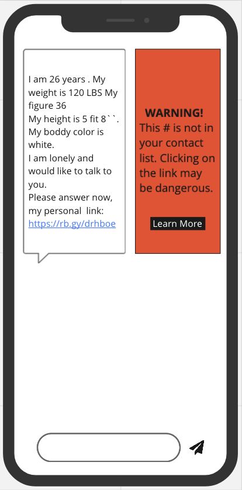

## Warnings for Spam Text Messages

This text message is very similar to messages that Mary Anne has received. Currently her iPhone offers no warning that the links in these kinds of messages could be dangerous. Our idea is to display a warning in the space next to the text message itself with a clear message and a link to more detailed information.

### Resources
- [Block, filter, and report messages on iPhone](https://support.apple.com/guide/iphone/block-filter-and-report-messages-iph203ab0be4/ios): Learn to block texts on iPhone.
- [How To Block Texts on an Android Device](https://www.alphr.com/android-block-texts/): Learn to block texts on Android.
- [have i been pwned?](https://haveibeenpwned.com/): Learn whether your information (e.g. phone number) has been leaked in a major hack.
- [Miro](https://miro.com): This is the tool we used to make our mockup.
